# Customer Churn Prediction and Business Insights

*Kaggle Playground Series S6E3* — End-to-end Data Science workflow for predicting customer attrition and uncovering behavioral drivers.


## Authors
- **Trương Ngô Phát**
- **Nguyễn Thị Yến Nhi**

---

## 1. Business Context and Problem Statement
Customer churn is one of the costliest challenges for subscription-based businesses. This project builds an analytical and predictive framework designed to:
* **Early Identification:** Accurately flag high-risk customers before they cancel their subscriptions.
* **Behavioral Driver Analysis:** Unearth core features (e.g., tenure length, pricing tiers, service engagement) driving churn.
* **Data-Driven Retention:** Provide quantitative insights to help Customer Success and Marketing teams deploy targeted retention campaigns.

---

## 2. Project Pipeline

```mermaid
flowchart TD
    subgraph Dashboard ["End-to-End Analytics Workflow"]
        direction LR
        A["<b>1. Raw Data</b><br/>📥 Train & Test Sets"]:::card1
        B["<b>2. EDA & Cleaning</b><br/>🧹 Missing Values & Insights"]:::card2
        C["<b>3. Feature Eng.</b><br/>⚙️ Encodings & N-grams"]:::card2
        D["<b>4. Modeling</b><br/>🤖 GBDTs & Deep Learning"]:::card3
        E["<b>5. Evaluation</b><br/>📊 ROC-AUC: 0.919"]:::card4

        A --> B --> C --> D --> E
    end

    %% Tùy chỉnh phong cách thẻ (Card styling) sang trọng, gọn gàng
    classDef card1 fill:#1e293b,stroke:#334155,stroke-width:2px,color:#f8fafc,rx:10,ry:10;
    classDef card2 fill:#0f172a,stroke:#0284c7,stroke-width:2px,color:#38bdf8,rx:10,ry:10;
    classDef card3 fill:#0f172a,stroke:#7c3aed,stroke-width:2px,color:#a78bfa,rx:10,ry:10;
    classDef card4 fill:#0f172a,stroke:#16a34a,stroke-width:2px,color:#4ade80,rx:10,ry:10;

    %% Phong cách khung tổng thể Dark Mode của Dashboard
    style Dashboard fill:#090d16,stroke:#1e293b,stroke-width:2px,rx:14,ry:14,color:#94a3b8;
```


## 3. Key Exploratory Data Analysis (EDA) and Insights
Derived from exploratory analysis workflows (notebooks/eda/):

- Behavioral Patterns: Discovered a sharp drop-off curve in customer retention during months 1–6, indicating a critical window for customer onboarding interventions.

- Data Cleansing and Missing Values: Systematic treatment of missing behavioral data using robust segmentation and imputation techniques.

- Feature Engineering: Developed custom features (N-gram string sequences and 5-fold CV Target Encoding) to capture complex non-linear patterns without data leakage.

## 4. Modeling and Performance
While a Data Analyst's primary focus is insight discovery, this project also benchmarks over 15 predictive models to ensure maximum generalization, achieving a top-tier leaderboard score of ROC-AUC: 0.91927:
- Baseline & GBDTs: LightGBM, XGBoost (cuDF), CatBoost.
- Deep Learning & Ensembling: TabM, RealMLP, AutoGluon, xLearn FFM, and stacking/blending strategies.
## 5. Repository Structure   
The repository follows software engineering standards to ensure high readability and seamless collaboration:   

```text
Predict-Customer-Churn/
├── data/
│   ├── raw/                 # Raw datasets (train.csv, test.csv, sample_submission.csv)
│   └── processed/           # Cleaned and engineered datasets
├── notebooks/
│   ├── eda/                 # Data visualization and business insight notebooks
│   ├── modeling/            # Core training pipelines and ensembling scripts
│   └── experiments/         # Deep learning and feature trials (TabM, ResNet, etc.)
├── local_scripts/           # Local execution scripts, logs, model checkpoints
├── kaggle_outputs/          # Out-of-fold predictions and weights
├── submissions/             # Final submission CSV files
├── docs/                    # Detailed reporting and documentation
└── .gitignore               # Git ignore configuration
```
## 6. Getting Started
- Clone the repository
git clone [https://github.com/Nhinn04/Predict-Customer-Churn.git](https://github.com/Nhinn04/Predict-Customer-Churn.git)
cd Predict-Customer-Churn
- Install dependencies
pip install -r requirements.txt
